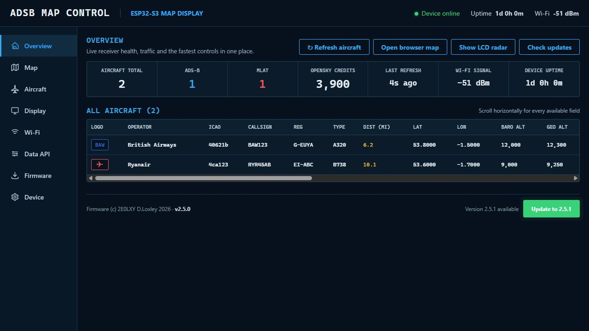
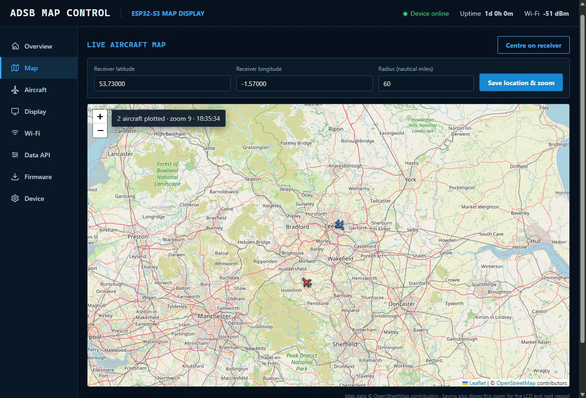
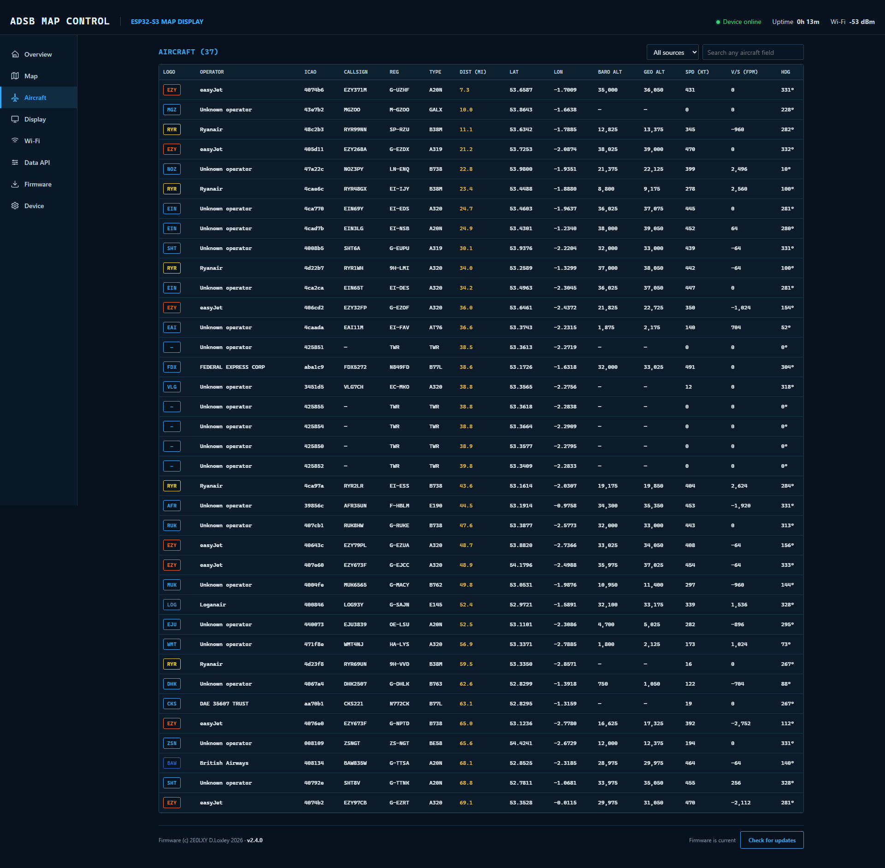
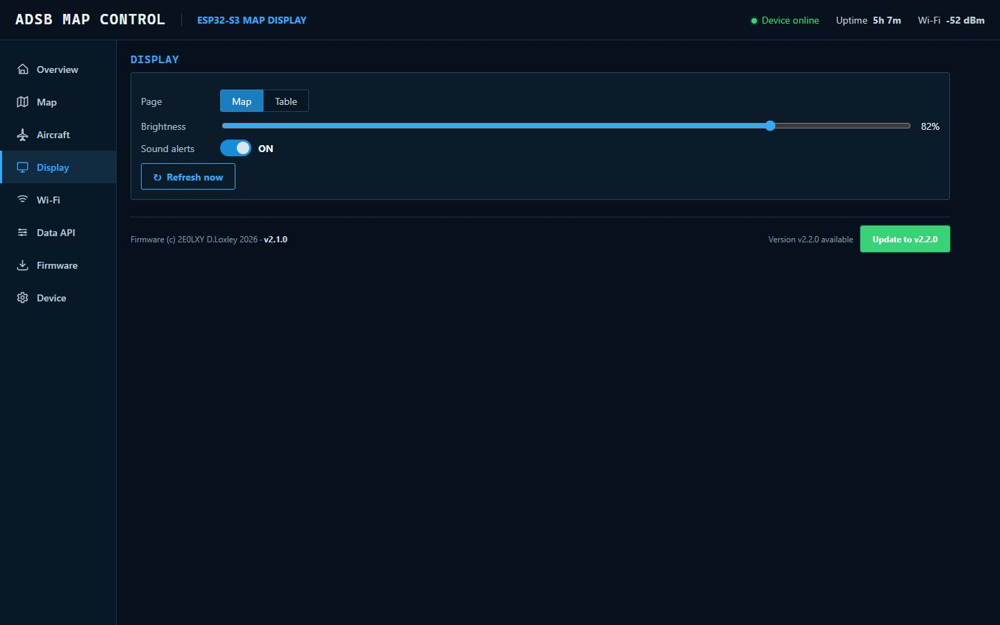
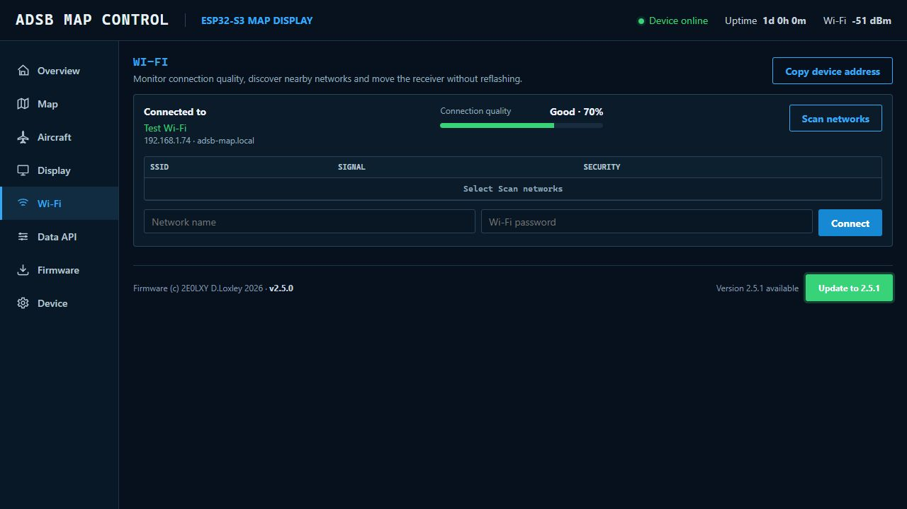
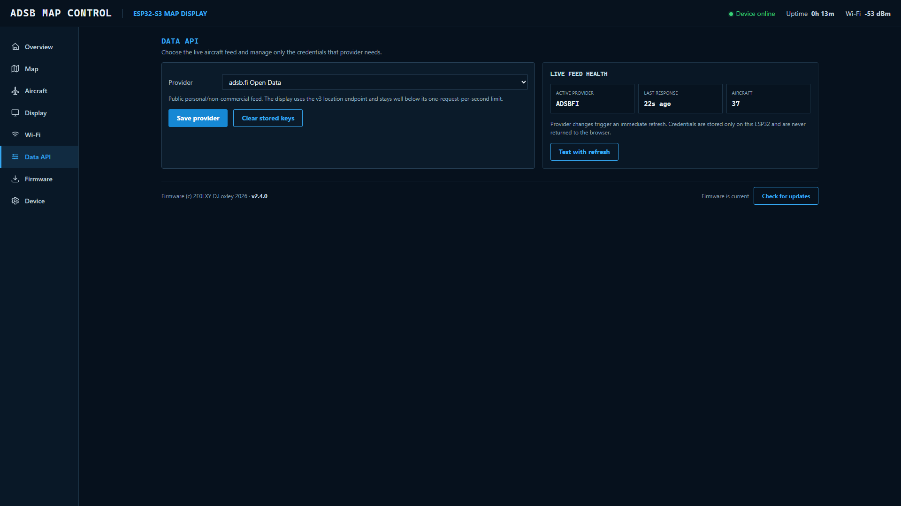
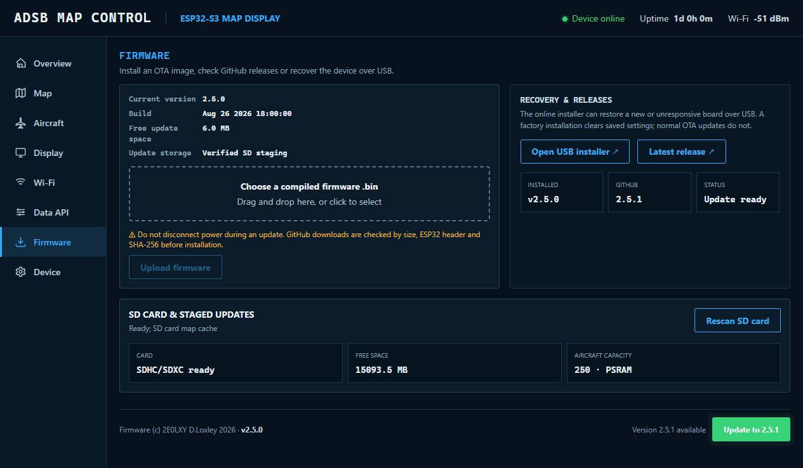
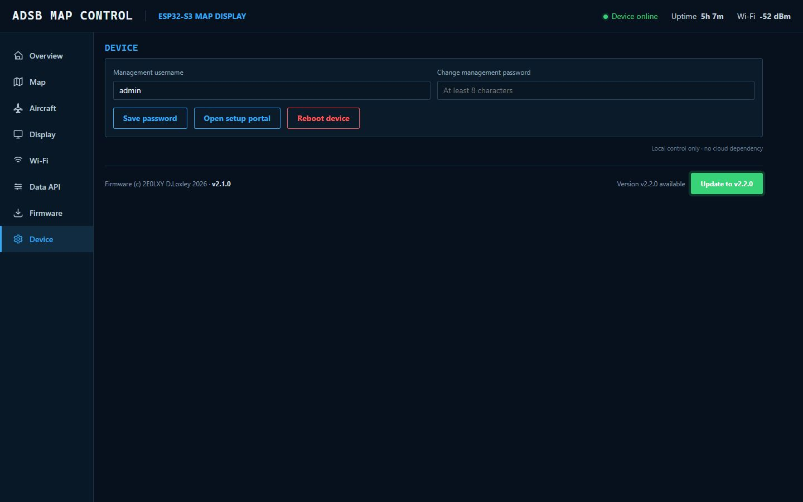
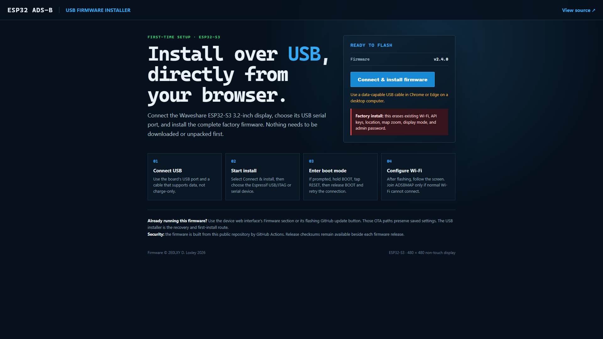

# ESP32 ADS-B

[](https://github.com/2E0LXY/ESP32-ADS-B/actions/workflows/release.yml)
[](https://2e0lxy.github.io/ESP32-ADS-B/)

[Install the firmware directly over USB](https://2e0lxy.github.io/ESP32-ADS-B/) · Chrome or Edge on desktop · no local flashing tools required

Firmware for the **Waveshare ESP32-S3 Touch-LCD-4 Rev 4.0, 480 × 480, non-touch panel**. It retrieves nearby ADS-B and MLAT aircraft, plots them on an OpenStreetMap base map on the LCD, and provides a password-protected web administration interface on the local network.

Also runs on the **Waveshare ESP32-S3-Touch-LCD-7 / -4.3, 800 × 480, GT911 touch** boards; see [Supported hardware](#supported-hardware).

Current firmware: **v2.5.1**

### Unreleased

- **LCD Overview page**: adds a route (`RTE`) column next to the nearest-aircraft strip, sourced from the same route cache used by the Table and Map pages
- **LCD Table page**: redesigned as an airport-departure-board style layout — alternating row colours, a yellow callsign, a single-letter green `A` / red `M` source instead of the word ADSB/MLAT, and tightened columns that give the freed width to the route column
- **LCD Table page route column**: shows the richest airport name that fits the available width — full names, then city names, then a departure-board-style abbreviation (`LON STAN`), then raw ICAO/IATA codes — instead of only ever showing short codes
- **Browser Aircraft/Overview tables**: the small logo-badge column is replaced by the operator's full name; the badge itself now appears in the map popup instead
- **Browser Aircraft/Overview tables**: the FROM/TO column shows the full airport names (e.g. "London Heathrow Airport -> John F Kennedy International Airport") instead of raw codes
- **Browser map**: clicking a marker now opens a popup with the complete aircraft detail set (operator badge, registration, altitude, speed, squawk, category, signal, country, emergency state, and more), not just a short summary
- **Browser map**: clicking a row in the Aircraft/Overview table jumps to the map, zooms in on that aircraft, and opens its popup; click the same row again to stop tracking
- **Browser map**: a "Show 5 min trails" checkbox draws each aircraft's recent track as a line, with the tracked aircraft's trail highlighted
- **Route cache persistence**: resolved routes now survive a reboot, saved to SD (or LittleFS without a card) after each batch of new lookups and reloaded at boot, so a receiver that sees the same flights daily doesn't start every session cache-cold
- **LCD Table/Overview route column**: distinguishes a route that's still queued for lookup (`---`) from one adsbdb was actually asked about and had nothing on file (`NO ROUTE` / `NO RTE`) - the latter is expected for most private/GA registrations, which have no scheduled route to look up
- Adds `scripts/flash_remote.ps1`, which starts the `esp_rfc2217_server.py` serial-to-network bridge if it isn't already running, then builds and flashes over it — useful for driving a board's USB port from another machine on the network
- **New Marine section and LCD page**: live AIS vessel tracking via [AISstream.io](https://aisstream.io)'s free WebSocket feed, centred on the receiver's saved position. Adds a new browser admin page (map, vessel table, AIS API key and radius settings) and a new physical LCD page in the Overview/Table/Map/Radar/Marine swipe cycle. There is no polling: vessel positions arrive as ships broadcast them over a persistent WebSocket connection. Adds the `links2004/WebSockets` library dependency

### v2.5.1 correctness and hardening

- Corrects the RGB panel timings to the Waveshare Rev 4.0 reference and sets an explicit 16.5 MHz pixel clock, raising the refresh rate from 42 Hz to about 59 Hz
- Reports at boot whether the vertical-blank DMA restart is actually supported by the running sdkconfig
- Validates TLS certificates on every outbound HTTPS request instead of trusting any certificate
- Requires a per-boot request token on every state-changing web route, so cached Basic credentials alone can no longer drive the device from another site
- Persists staged-update metadata so firmware staged on SD before a reboot can still be verified and installed
- Evicts cached map tiles when the view changes or storage runs low, and deletes tiles that fail to decode
- Restores the previous Wi-Fi network automatically if new credentials fail to connect within 45 seconds
- Scales LCD brightness to the full 0-255 range instead of writing the raw percentage
- Reports genuine LCD map rebuild progress and keeps the admin interface responsive while tiles download
- Falls back to the release SHA256SUMS.txt when the GitHub API omits an asset digest
- Accepts signing keys up to RSA-4096 rather than only RSA-2048
- Stops compiling OpenSky credentials into the binary unless `ADSB_BAKE_CREDENTIALS` is defined
- Fetches the aircraft table only for pages that display it

### v2.5.0 SD storage and safer updates

- Detects the optional microSD card at boot and from a new Firmware-page rescan control
- Moves the physical OpenStreetMap tile cache to SD when a card is available, with automatic LittleFS fallback
- Holds up to 250 live aircraft records in PSRAM while reducing reserved internal RAM
- Parses provider responses directly from the network with field filtering instead of retaining a second full response copy
- Builds large aircraft web responses in PSRAM to prevent the earlier Map/Table/reboot memory peak
- Stages GitHub firmware on SD and verifies its ESP32 header, exact size, SHA-256 and RSA release signature before OTA installation
- Applies the same release integrity and signature checks to direct OTA when no SD card is fitted
- Reports card type, capacity, cache location, aircraft capacity and staged-update state in the admin interface
- Prevents Radar screen wrap and white DMA flecks by recovering RGB DMA on vertical blank and reducing full-frame redraw pressure

### v2.4.1 reliability fixes

- Rejects empty, malformed, undersized, and non-ESP32 firmware uploads without rebooting
- Handles Arduino-ESP32 raw POST callbacks safely before accessing multipart upload state
- Releases large aircraft-response buffers before route lookups to prevent TLS allocation failures
- Retries unsuccessful route lookups after five minutes instead of caching failures for six hours
- Validates numeric settings and credential lengths on both the browser and ESP32
- Reports live feed result, HTTP status, and request duration in **Data API**
- Deduplicates Wi-Fi scan results and fixes phone-width overflow on the Wi-Fi page
- Checks that release tags, firmware, README, installer, and manifest versions agree before publishing
- Removes the management password from serial output

## Quick start

1. Open the [online USB installer](https://2e0lxy.github.io/ESP32-ADS-B/) in desktop Chrome or Edge and connect the ESP32-S3 by USB.
2. Install the factory image, restart the receiver, and connect to the `ADSBMAP` setup network if no saved Wi-Fi is available.
3. Choose a 2.4 GHz Wi-Fi network. The LCD waits for Wi-Fi and then displays the receiver's LAN address.
4. Open that address, sign in with `admin` / `aircraft`, and immediately set a new password in **Device**.
5. Set the receiver latitude, longitude, radius, and zoom in **Map**, then choose an aircraft feed in **Data API**.


## Main features

- Live aircraft map on the 480 × 480 display and in the browser
- OpenStreetMap tiles cached on microSD when fitted, with automatic LittleFS fallback
- Up to 250 live aircraft records held in PSRAM without consuming the card's write life
- ADS-B and MLAT aircraft shown with distinct colours and heading markers
- Receiver latitude, longitude, and radius configurable from the web interface
- Receiver changes applied to the browser map, LCD map, API query area, and distance calculations
- Browser zoom saved to NVS and reused by the physical LCD map after reboot
- Full Overview aircraft table with operator names and all common provider fields
- Click any aircraft row to jump to the browser map, zoom in, and track it; toggle 5-minute movement trails on the map
- Selectable aircraft-data providers with editable API credentials
- Wi-Fi network scanning and connection management
- Local firmware upload plus automatic update checks from GitHub Releases
- Password-protected administration with a change-password page
- Persistent Map, Radar, and Table display modes selectable from the web interface or BOOT button
- Animated aircraft radar with four saved-radius range rings and red out-of-range rim targets
- First-time USB flashing from the GitHub Pages Web Serial installer
- Centred, wide-screen admin pages with receiver quick actions and live health summaries
- One-click radar range presets, Wi-Fi quality meter, recovery links, and privacy-safe diagnostic export
- Boot screen displays the management IP address after Wi-Fi connects

## Supported hardware

| Board | Panel | Touch | Backlight | PlatformIO env |
| --- | --- | --- | --- | --- |
| Waveshare ESP32-S3-Touch-LCD-4 Rev 4.0 | 480 × 480 | None | Full 0-255 PWM via the CH32 expander | `waveshare_esp32_s3_lcd_4` |
| Waveshare ESP32-S3-Touch-LCD-7 / -4.3 | 800 × 480 | GT911, swipe to change page | On/off only via the CH422G expander (no PWM on this board) | `ws_lcd_7_app` |

Panel geometry, pins, and the expander driver are all resolved from `src/board_config.h` and `src/boards/*.h`, so the same application source builds for either board. Set the environment's `board_build.*` and `-DADSB_BOARD_*` build flag in `platformio.ini` to switch boards; see the `## Build` section below for the exact commands.

## First login

After Wi-Fi connects, the LCD displays the address of the web interface. Open that IP address in a browser on the same network, or try `http://adsb-map.local/`.

| Setting | Initial value |
| --- | --- |
| Username | `admin` |
| Password | `aircraft` |
| Setup access point | `ADSBMAP` |
| Setup portal | `http://192.168.4.1/` |

Change the management password in **Device** after installation. The replacement password must contain at least eight characters.

## Web administration

Each sidebar entry opens a separate page. The footer on every page shows `Firmware (c) 2E0LXY D.Loxley 2026`, the installed version, and the GitHub update control.

| Page | Live information | Main controls | Saved after reboot |
| --- | --- | --- | --- |
| Overview | Receiver health, traffic totals, provider, Wi-Fi, uptime, and full aircraft table | Refresh traffic, open Map/Radar, check updates | — |
| Map | Receiver position, range, zoom, OpenStreetMap tiles, and aircraft | Position, radius, centre, zoom, click-to-track, 5-minute trails | Yes |
| Aircraft | Every available aircraft field, operator name, source, age, signal, and emergency | Search, source filter, click a row to track it on the map | — |
| Display | Active LCD page, brightness, alert state, and map-tile rebuild state | Map/Radar/Table, brightness, range presets, zero-mile alert, refresh | Yes |
| Wi-Fi | SSID, signal quality, IP, gateway, DNS, and scan results | Scan, copy address, connect to a different network | Wi-Fi credentials |
| Data API | Selected provider, request health, aircraft count, latency, and credential state | Select feed, edit/clear credentials, refresh test | Yes |
| Marine | Live AIS vessel positions, connection state, vessel count | AIS API key, tracking radius, browser vessel map and table | Yes |
| Firmware | Installed/latest version, update availability, and release status | GitHub OTA, local `.bin` upload, installer/release recovery links | Firmware only |
| Device | Identity, runtime, memory, network, display, and feed diagnostics | Password, diagnostic JSON, setup portal, reboot | Password |

### Overview

Connection, aircraft, provider, display, and firmware status at a glance, followed by the complete horizontally scrollable live-aircraft table. Quick actions refresh the feed, open the browser map, switch the LCD to Radar, or check GitHub for an update.



### Map

Live OpenStreetMap view of the received aircraft. Save a new receiver position, radius, and current browser zoom here; the same values immediately control the LCD map, provider query bounds, and aircraft-distance calculations and remain stored after reboot. Click a marker for its full detail popup, click a row on the Aircraft/Overview page to jump here and track that aircraft, or enable **Show 5 min trails** to draw each aircraft's recent track.



### Aircraft

Searchable live table containing operator name, ICAO address, callsign, registration, aircraft type, distance, coordinates, barometric/geometric altitude, speed, vertical rate, heading, squawk, category, ground state, data age, messages, signal, country, full-name route, source, and emergency state. Click a row to jump to the Map page and track that aircraft.



### Display

Select the physical Map, Radar, or Table page, set brightness, enable or disable the zero-mile alert, and request an immediate refresh. One-click range presets set 10, 25, 50, or 100 nautical miles. Radar mode uses the saved receiver position and radius, draws a moving sweep, and marks out-of-range aircraft in red at the rim. The page also reports LCD tile-cache rebuild progress after a position, range, or zoom change. The selected page remains active after reboot.



### Wi-Fi

View the active connection, signal quality, LAN address, gateway, and DNS server; copy the management address; scan nearby networks; and move the receiver to a different 2.4 GHz Wi-Fi network.



### Data API

Select an aircraft provider and replace or clear the credentials required by that provider. Live feed health shows the last result, HTTP status, request time, aircraft count, and credential state, with a manual refresh test for troubleshooting.



### Marine

Live ship positions from [AISstream.io](https://aisstream.io), centred on the same receiver position used for aircraft. Enter a free AISstream.io API key and a tracking radius (5-250 nm; typical VHF AIS coastal range is 20-40 nm), then save. The receiver holds a persistent WebSocket connection to AISstream.io and plots vessels as they broadcast - there is no polling interval to wait on. The page shows connection status, vessel count, time since the last message, a Leaflet map, and a searchable vessel table (name, MMSI, type, navigational status, speed, course, heading, distance).

### Firmware

Install a local `.bin` image, check GitHub for a new release, or install the latest release directly. The green update button pulses when a newer semantic version is available. With microSD present the download is staged there; otherwise direct OTA is used. Both **GitHub** routes require the published size, SHA-256 digest, RSA signature and ESP32 image header to validate before installation. A **local `.bin` upload is not signature-checked** — it is validated only for the ESP32 image header and a minimum size, so upload only images you built or trust. The page reports card state and has a manual rescan control.



### Device

Review device identity, uptime, memory, network, display, and feed status; download a privacy-safe diagnostic JSON file; change the management password; reopen the Wi-Fi setup portal; or reboot the ESP32. The diagnostic export deliberately excludes Wi-Fi passwords, API secrets, and the management password.



## Aircraft-data providers

| Web selection | Endpoint pattern | Credentials | Notes |
| --- | --- | --- | --- |
| OpenSky Network | `/api/states/all` | Optional OAuth client ID and secret | Uses a receiver-centred bounding box; falls back to anonymous access when credentials are blank. |
| adsb.fi Open Data | `/api/v3/lat/.../lon/.../dist/...` | None | Free/open data endpoint. |
| airplanes.live | `/v2/point/...` | None | ADS-B Exchange v2-compatible response. |
| adsb.lol Open API | `/v2/point/...` | None currently | Free/open API; the key field is retained in case the service changes. |
| ADSB One / API archive | `/v2/point/...` | None | Experimental legacy-compatible source. |
| ADS-B Exchange via RapidAPI | `/v2/lat/.../lon/.../dist/...` | RapidAPI key | Requires the relevant RapidAPI subscription. |

The ESP32 stores credentials in Preferences/NVS. Existing secrets are never returned by the status API, and submitting an empty credential field preserves the stored value unless **Clear** is selected.

## GitHub OTA updates

The firmware checks the latest release from `2E0LXY/ESP32-ADS-B` at startup and every six hours. If a newer version exists, the footer button flashes green. Pressing it downloads the release firmware and detached signature. The ESP32 validates the exact asset size, SHA-256 digest, RSA signature and image header before writing the inactive OTA slot, and reboots only after a successful complete write. With microSD fitted, the verified image is staged on the card first.

Remote receivers do not need inbound access or to be on the maintainer's LAN. They make an outbound HTTPS request to GitHub. The notification is the pulsing green button in the receiver's local admin interface; this firmware does not send email, SMS, or a phone push notification.

Do not remove power while an update is being installed. The `default_16MB.csv` partition layout supplies two application slots for OTA updates.

Creating and pushing a tag such as `v2.5.0` runs `.github/workflows/release.yml`, builds both upgrade and factory images, signs the OTA image with the protected `FIRMWARE_SIGNING_KEY` repository secret, generates SHA-256 checksums, and attaches them to a GitHub Release. A successful release then triggers `.github/workflows/pages.yml`, which publishes the same factory asset to the online USB installer.

| Release asset | Use |
| --- | --- |
| `ESP32-ADSB-firmware.bin` | Normal OTA or local web update; preserves settings |
| `ESP32-ADSB-firmware.bin.sig` | Detached RSA/SHA-256 signature required by GitHub OTA |
| `ESP32-ADSB-factory.bin` | First installation or full recovery; clears saved settings |
| `SHA256SUMS.txt` | Integrity hashes for the published firmware files |

## Build

Install [PlatformIO](https://platformio.org/), clone the repository, and run:

```powershell
pio run
```

This builds the default `waveshare_esp32_s3_lcd_4` environment (the 480 × 480 WS4 board). For the 800 × 480 WS7 board, select its environment explicitly:

```powershell
pio run -e ws_lcd_7_app
```

The OTA image is generated at:

```text
.pio/build/waveshare_esp32_s3_lcd_4/firmware.bin
.pio/build/ws_lcd_7_app/firmware.bin
```

To build, flash, and (optionally) keep a serial bridge running automatically from another machine on the network, see `scripts/flash_remote.ps1`.

## USB installation

For a new board or recovery install, open the [online USB firmware installer](https://2e0lxy.github.io/ESP32-ADS-B/) in desktop Chrome or Edge. It uses Web Serial to identify the ESP32-S3 and writes the complete factory image. A factory install clears saved Wi-Fi, API credentials, location, zoom, display mode, and admin password.



For later updates, use the device administration interface's Firmware page or flashing GitHub update button; those OTA paths preserve settings.

### PlatformIO alternative

Connect the board by USB, then run:

```powershell
pio run -t upload
```

To select the development board explicitly on Windows:

```powershell
pio run -t upload --upload-port COM25
```

If the board does not enter download mode, hold **BOOT**, tap **RESET**, begin the upload, and then release **BOOT**.

## Physical display behaviour

- Short BOOT-button press (or a swipe on the WS7 touch panel): cycles the LCD through Overview, Table, Map, Radar, and Marine, and saves the selection
- Overview page: map on the left with a compact nearest-aircraft strip (callsign, distance, altitude, route) on the right
- Table page: airport-departure-board style list with operator badge, callsign, distance, source, direction, altitude, and the fullest airport name that fits the panel width
- Marine page: the same base map with live AIS vessel positions plotted as heading-oriented ship markers; shows vessel count and AIS connection state, or `AIS NOT CONFIGURED` until an API key is saved in the Marine admin page
- Aircraft data refresh: every 30 seconds or on demand
- ADS-B aircraft: cyan/operator-coloured symbol
- MLAT aircraft: violet/red symbol
- AIS vessel positions: event-driven over a persistent WebSocket, not polled - a quiet Marine page in low-traffic water is normal
- Route lookup: public ADSBDB callsign endpoint, cached for six hours and persisted to SD (or LittleFS without a card) so a reboot doesn't start cold; the Table page shows the fullest name that fits (full name, then city, then a departure-board-style abbreviation, then the raw code), while the Overview and Map pages show the raw code. `NO ROUTE` / `NO RTE` means adsbdb was asked and had nothing on file (typically a private/GA registration), distinct from `---` which means still queued
- Zero-mile aircraft: optional 200 ms buzzer alert
- OSM failure: falls back to the built-in radar-style map

## OpenStreetMap usage

Map data is © OpenStreetMap contributors. The browser and LCD show attribution. The LCD requests only the tiles visible for the configured receiver area, identifies this firmware in its User-Agent, and caches tiles on microSD when available or LittleFS otherwise. Do not modify the firmware to bulk-download tiles from the public OpenStreetMap tile service.

## Security notes

- All web-management and JSON API routes use HTTP Basic authentication.
- Every state-changing route additionally requires an `X-ADSB-Token` header carrying a token regenerated at each boot. This blocks cross-site requests that would otherwise ride on cached Basic credentials.
- Outbound HTTPS and the AIS WebSocket connection both validate certificates against the ESP-IDF root bundle. Build with `-DADSB_TLS_INSECURE=1` only if that bundle is unavailable in your toolchain.
- Change the initial password before placing the receiver on a shared network.
- The admin interface is intended for a trusted local network and does not provide TLS.
- Wi-Fi, provider, and AIS credentials remain in ESP32 NVS and are excluded from Git.

## Diagnostics and troubleshooting

- If the boot screen says **Wi-Fi connecting**, wait for the LAN address before opening the admin interface. `192.168.4.1` is only the temporary setup portal address.
- If Wi-Fi fails, connect to the `ADSBMAP` access point and open `http://192.168.4.1/`.
- If the LCD says **Rebuilding LCD map**, leave the receiver powered while it downloads and caches tiles for the newly saved position, range, or zoom.
- If aircraft stop updating, open **Data API**, run **Refresh / test feed**, and check the returned HTTP status and latency.
- The browser map uses Leaflet and OpenStreetMap tiles loaded from the internet. On an isolated network the **Map** page shows a fallback message; every other page, and the LCD map, still work from cached tiles.
- For support, download the JSON file from **Device → Download diagnostics**. It contains useful runtime state without passwords or API secrets.
- For recovery, use the online USB installer. A factory flash erases configuration, while normal OTA firmware preserves it.

## Refreshing the documentation screenshots

With the receiver online, install Playwright, set `NODE_PATH` if required by the local Node installation, and run:

```powershell
$env:ADSB_SCREENSHOT_URL = "http://receiver-ip/"
$env:ADSB_SCREENSHOT_USERNAME = "admin"
$env:ADSB_SCREENSHOT_PASSWORD = "your-password"
node scripts\capture_admin_screenshots.cjs
```

The script captures every current admin section plus the public USB installer into `docs/screenshots/`. It waits for live receiver data and map tiles, reports browser errors, and replaces the visible SSID with `Home Wi-Fi` before saving documentation images.

## Copyright

Firmware (c) 2026 2E0LXY / D. Loxley. All rights reserved. No open-source licence is granted unless a `LICENSE` file is added to the repository.

## Build flags

| Flag | Default | Effect |
| --- | --- | --- |
| `ADSB_ENABLE_TOUCH` | `0` | The Rev 4.0 480 x 480 panel has no touch controller. Set to `1` to probe the GT911 at boot and poll it each loop. |
| `ADSB_TLS_INSECURE` | `0` | Set to `1` to skip TLS certificate validation. Only for toolchains without the ESP-IDF certificate bundle. |
| `ADSB_BAKE_CREDENTIALS` | undefined | Compiles OpenSky credentials from `credentials.json` into the image. Never define this for a build you intend to publish; compiled-in secrets are recoverable with `strings firmware.bin`. |
| `DISPLAY_DIAGNOSTIC` | undefined | Replaces normal operation with a colour-cycle panel test. |

Serial ports are no longer hard-coded. Select one per invocation:

```powershell
pio run -t upload --upload-port COM25
```

## Panel timings

The RGB timings come from the Waveshare Rev 4.0 reference, retained at
`docs/hardware-reference-rev3-ST7701.h`: HPW 8, HBP 10, HFP 50, VPW 2, VBP 18,
VFP 8, with an explicit 16.5 MHz pixel clock giving roughly 59 Hz over the
548 x 508 total. If the panel shows tearing or a horizontal offset, these
constants at the top of `src/main.cpp` are the first thing to adjust.
